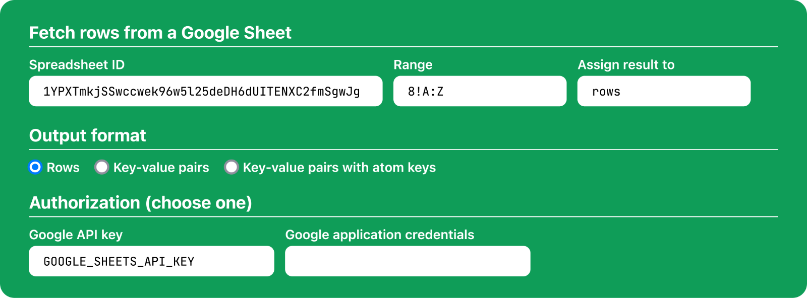

# KinoSheetex



KinoSheetex is a Livebook smart cell for fetching rows from a Google Sheet.
Authorization with Google APIs is required, either via an API key or an OAuth token
([see documentation](https://developers.google.com/workspace/guides/create-credentials)).

Documentation: <https://hexdocs.pm/kino_sheetex/>.

## Installation

The package can be installed by adding `kino_sheetex` to `Mix.install/2`.

```elixir
Mix.install([
  {:kino_sheetex, "~> 0.3.0"}
])
```
